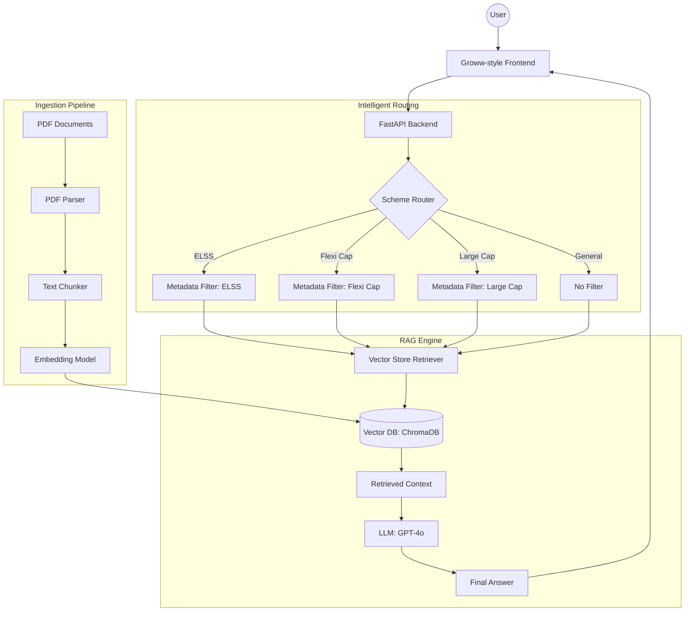

# HDFC Mutual Fund FAQ Chatbot Architecture

This document outlines the architecture and phase-wise development plan for the **Groww-themed HDFC Mutual Fund FAQ Assistant**.

## Architecture Overview

The system utilizes a **Retrieval-Augmented Generation (RAG)** architecture, supplemented with a **Query Router** to handle scheme-specific information accurately across HDFC Large Cap, Flexi Cap, and ELSS funds.

## Phase-wise Development Plan

### Phase 1: Knowledge Base & Basic RAG
**Objective**: Build a functional prototype that can answer questions based on the provided HDFC PDFs.
- **Data Preparation**: Extraction and cleaning of text from HDFC scheme documents (SID, KIM, Factsheets).
- **Vector Database**: Setup ChromaDB/Pinecone with OpenAI embeddings.
- **Basic Retrieval**: Implementation of a basic search-and-retrieve pipeline.
- **LLM Integration**: Formatting context for GPT-4o to generate helpful, fact-based answers.

### Phase 2: Advanced Retrieval & Routing
**Objective**: Improve precision by identifying the specific mutual fund scheme in the user's query.
- **Query Semantic Router**: Classify queries into "Scheme-specific" or "General FAQ".
- **Metadata Tagging**: Ensure all chunks in the Vector DB are tagged with scheme identifiers (e.g., `scheme: hdfc_elss`).
- **Filtered Retrieval**: Apply metadata filters during retrieval to prevent "hallucinations" between different fund rules.

### Phase 3: Groww-style Frontend UI
**Objective**: Deliver a premium user experience consistent with the Groww design system.
- **Aesthetics**: Dark mode support, vibrant green accents (#00D09C), and clean typography (Inter/Roboto).
- **Responsive Design**: Mobile-first chat interface with smooth micro-animations.
- **API Integration**: Connect the React/Vite frontend to the FastAPI backend.

### Phase 4: Conversational Memory & Polish
**Objective**: Enable multi-turn dialogue and finalize the assistant.
- **Chat History**: Implementation of conversational memory to handle follow-up questions (e.g., "What about its exit load?").
- **Performance Evaluation**: Verify RAG performance (Faithfulness, Answer Relevance).
- **Project Cleanup**: Documentation and final architecture refinement.
